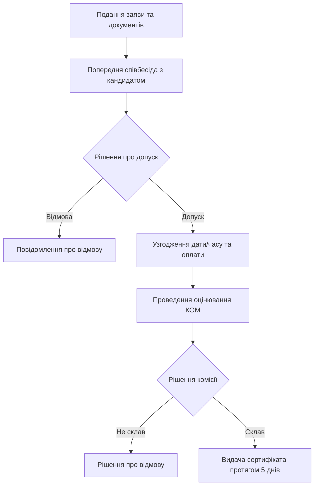

# Аналіз нормативних документів проєкту

Цей документ містить детальний аналіз нормативно-правової бази та професійного стандарту, які знаходяться в теці проєкту. Ці матеріали є основою для створення вебресурсу Кваліфікаційного центру для тестування та сертифікації фахівців із супроводу ветеранів війни та демобілізованих осіб.

---

## 1. Постанова КМУ № 986 «Деякі питання акредитації кваліфікаційних центрів»

Постанова визначає правові засади створення, функціонування та акредитації кваліфікаційних центрів в Україні Національним агентством кваліфікацій (НАК).

### Ключові вимоги для вебресурсу:
* **Обов'язкова наявність вебсайту**: Згідно з пунктом 8, однією з критеріїв спроможності центру є:
  > *«наявність веб-сайта для розміщення інформації про кваліфікаційний центр, відповідні професійні кваліфікації та процедуру присвоєння/підтвердження»*.
* **Публічний доступ до інформації**: На сайті мають бути оприлюднені:
  1. Заява про акредитацію та статус центру.
  2. Відомості про матеріально-технічну базу та оцінювачів (експертів).
  3. Перелік професійних кваліфікацій, на які акредитовано центр.
  4. Процедура присвоєння/підтвердження кваліфікацій.
  5. Рішення про видачу або скасування сертифікатів (пункт 27, 28).

---

## 2. Постанова КМУ № 956 «Порядок присвоєння та підтвердження професійних кваліфікацій»

Постанова регламентує безпосередній процес взаємодії здобувача (ветерана або іншої особи) з кваліфікаційним центром.

### Етапи процедури оцінювання (Пункт 5):

### Вимоги до сертифіката (Пункт 15):
Сертифікат про присвоєння/підтвердження професійної кваліфікації повинен мати унікальну серію та реєстраційний номер за шаблоном:
$$\text{СС ХХХХХХХХ/УУУУУУ-ZZ}$$
* **СС**: серія документа (кирилицею).
* **ХХХХХХХХ**: ЄДРПОУ юридичної особи (кваліфікаційного центру).
* **УУУУУУ**: порядковий номер документа.
* **ZZ**: останні дві цифри року видачі.

---

## 3. Професійний стандарт «Фахівець із супроводу ветеранів війни та демобілізованих осіб»

Це ключовий документ, що визначає зміст майбутнього тестування. Стандарт затверджено наказом Мінветеранів № 508 від 31.12.2024.

### Рівні кваліфікації та вимоги до освіти/стажу:

| Назва кваліфікації | Рівень НРК | Вимоги до освіти | Вимоги до стажу |
| :--- | :---: | :--- | :--- |
| **Фахівець із супроводу** | 6 | Бакалавр (усі спеціальності визначених галузей*) | Без вимог до стажу |
| **Фахівець II категорії** | 6 | Бакалавр (визначених галузей*) | Стаж на посаді фахівця або у сфері соц. роботи/медицини/оборони від 1 року |
| **Фахівець I категорії** | 6 | Бакалавр (визначених галузей*) | Стаж на посаді фахівця II категорії від 2 років або у відповідній сфері від 3 років |
| **Провідний фахівець** | 7 | Магістр (усі спеціальності визначених галузей*) | Стаж не регламентується стандартом (визначається посадовою інструкцією) |

> [!NOTE]
> **Дозволені галузі знань для кандидатів:** 
> * А «Освіта» (усі)
> * В «Культура, мистецтво та гуманітарні науки» (Богослов’я, Історія, Філологія, Соціокультурна діяльність)
> * С «Соціальні науки, журналістика та інформація» (Економіка, Політологія, Психологія, Соціологія, Журналістика, Міжнародні відносини)
> * D «Бізнес, адміністрування та право» (Право, Менеджмент, Публічне управління, Маркетинг, Облік, Фінанси)
> * F «Інформаційні технології» (усі)
> * G «Інженерія, виробництво та будівництво» (усі)
> * I «Охорона здоров’я та соціальне забезпечення» (усі)
> * J «Транспорт та послуги» (Охорона праці)
> * К «Безпека та оборона» (усі)

---

## 4. Карта трудових функцій для тестування

Для створення системи тестування ми повинні використати структуру з 8 ключових трудових функцій, визначених стандартом:

1. **А. Організація і планування роботи**
   * *Знання*: Нормативно-правові акти (НПА) та інструкції з діловодства, правила оформлення журналів прийому, НПА про звернення громадян, основи комп'ютерної грамотності.
2. **Б. Ведення обліку ветеранів війни та членів їх сімей**
   * *Знання*: Джерела та методи збору інформації, структура Єдиного державного реєстру ветеранів війни (ЄДРВВ), стандарти інформаційної безпеки, захист персональних даних.
3. **В. Проведення зустрічей та первинне виявлення потреб**
   * *Знання*: Методи первинної оцінки потреб, комунікативні технології (у т.ч. кроскультурна комунікація), основи психології спілкування, виявлення кризових станів.
4. **Г. Інформування та консультування**
   * *Знання*: Права, пільги та гарантії ветеранів (житлові, медичні, освітні, соціальні), механізми надання публічних послуг, НПА з соціального захисту.
5. **Д. Здійснення супроводу ветеранів війни та членів їх сімей**
   * *Знання*: Кейс-менеджмент (ведення випадку), взаємодія з органами місцевого самоврядування, ЦНАП, медичними та реабілітаційними закладами.
6. **Е. Підготовка ветеранів та демобілізованих осіб до переходу до цивільного життя**
   * *Знання*: Адаптаційні програми, профорієнтація, кар'єрне консультування, можливості перенавчання та працевлаштування ветеранів.
7. **Є. Проведення моніторингу та оцінювання потреб**
   * *Знання*: Інструменти збору відгуків, методики оцінки якості наданих послуг, коригування індивідуального плану супроводу.
8. **Ж. Формування та розвиток професійної компетентності**
   * *Знання*: Професійна етика, методи запобігання професійному вигоранню, супервізія та інтервізія, самоорганізація.

---

## Концепція вебресурсу Кваліфікаційного центру

Спираючись на ці дані, вебресурс повинен містити такі компоненти:
1. **Інформаційний портал**: Офіційний опис Центру, нормативна база, умови сертифікації, вимоги до освіти кандидатів з інтерактивним калькулятором відповідності.
2. **Особистий кабінет здобувача**:
   * Подання заяви (завантаження документів: диплом, паспорт, підтвердження досвіду).
   * Інтерактивний покроковий майстер (Wizard) з перевіркою та підписанням (емуляція КЕП).
3. **Інтерактивний тренажер тестування**:
   * Онлайн-тест з випадковим вибором питань з усіх 8 трудових функцій.
   * Оцінка результатів з детальною аналітикою (показ сильних та слабких сторін здобувача).
4. **Панель адміністратора**:
   * Верифікація поданих заяв.
   * Видача та реєстр електронних сертифікатів згідно з формулою `СС ХХХХХХХХ/УУУУУУ-ZZ`.
